<h1 align="center">VitaXMB</h1>

<p align="center">
  <b>A PSP-style XMB launcher for the PlayStation Vita.</b><br>
  The cross media bar, rebuilt for the Vita: your games and homebrew, music, settings and system apps in the layout, motion and sound of the original.
</p>

<p align="center">
  
</p>

<p align="center">
  
  
  
</p>

---

## Contents

- [Features](#features)
- [Screenshots](#screenshots)
- [Controls](#controls)
- [Installing](#installing)
- [Starting VitaXMB when the Vita turns on](#starting-vitaxmb-when-the-vita-turns-on)
- [Building from source](#building-from-source)
- [How it works](#how-it-works)
- [Game artwork](#game-artwork)
- [Music and video](#music-and-video)
- [Folders](#folders)
- [Updates](#updates)
- [Custom themes (beta)](#custom-themes-beta)
- [Extra storage (experimental)](#extra-storage-experimental)
- [Settings reference](#settings-reference)
- [Repository layout](#repository-layout)
- [Known issues](#known-issues)
- [Credits and licenses](#credits-and-licenses)

## Features

**The XMB, faithfully**

- Six categories on a horizontal bar (Settings, Photo, Music, Video, Game, Network) with the PSP's icon sizes, spacing, glow, drop shadows, rules under selected titles and its monthly color themes with the animated waves.
- The two-level layout the PSP uses for Settings: the open category slides left, the parent list collapses into an icon column, and the child list shows wrench-badge rows with values on the right.
- A wide-icon **game list**: the selected title grows into a landscape tile while neighbours stack above and below. Rest on a game and its full-screen background art fades in behind the list.
- The PSP's real **wave background** (the firmware's own wave model, animated the way the PSP animates it) and its **boot intro** (logo, ribbon and glow with the month's tint) before the XMB appears.
- Startup animation (fade in, bar and lists slide in together), the XMB sound set (opening, cursor, cancel, confirm, start game), PSP-style confirmation dialogs and the **Options** panel opened with the triangle button.
- Text is rendered the way the PSP does it: a soft drop shadow, kerned, sub-pixel positioned and glued to its icon while scrolling.

**Made for the Vita**

- **Game** lists every installed title and homebrew bubble (and your saved data), reads each app's own LiveArea artwork, and starts it. *Information* shows title, ID, version and location.
- **Hide categories** you don't use (Photo, Music, Video, Network) in *Settings > VitaXMB Settings*; the bar closes up and left/right skip them.
- **Folders** keep a big library tidy: create folders in the game list and tick the games and homebrew that belong in each one (see [Folders](#folders)).
- **Settings** has real, working pages: *System Information* (firmware, nickname, MAC address, model, memory card, battery, CPU clock), plus VitaXMB's own settings (theme color, clock format, sound effects, startup animation, confirmation dialogs, launch method).
- **Music** is an MP3 player with the PSP's player screen: LED spectrum analyzer driven by the real audio, track badge, ID3 title and artist, elapsed and total time, progress bar, next/previous and seeking.
- **Network, Photo, Video** hand off to the Vita's own apps (Internet Browser, PlayStation Store, Party, Messages, Near, Photos, Videos), and Settings opens the Vita's real settings pages.
- **Video** lists the videos in `ux0:pspemu/VIDEO`.

**Updates and themes**

- **Network Update** is the first item under Settings, like the PSP's System Update: it checks GitHub for a new release, shows the release notes and installs it for you (see [Updates](#updates)).
- **PSP custom themes (beta)**: drop `.ctf` / `.ptf` theme files in a folder and apply them from *Settings > Theme Settings* (see [Custom themes (beta)](#custom-themes-beta)).

**Engineering**

- Smooth scrolling on a very large game library: icons and backgrounds are decoded on worker threads and uploaded a couple per frame; GPU textures are only freed once the GPU has finished with them.
- Own text engine: FreeType glyphs with light auto-hinting in a padded atlas, HarfBuzz shaping (OpenType kerning), a pre-blurred shadow per glyph.
- A baseline-normalised font so every letter, at every UI size, lands on the same pixel row (see [Fonts](#fonts)).

## Screenshots

| | |
|---|---|
| 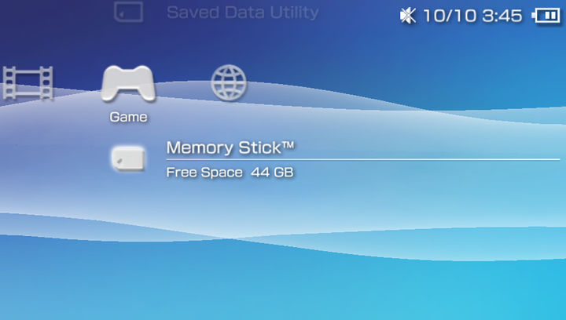 <br> **Game** - installed titles and saved data | 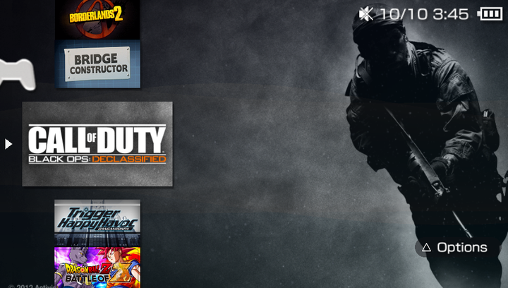 <br> **Game list** - wide tiles, background art on rest |
| 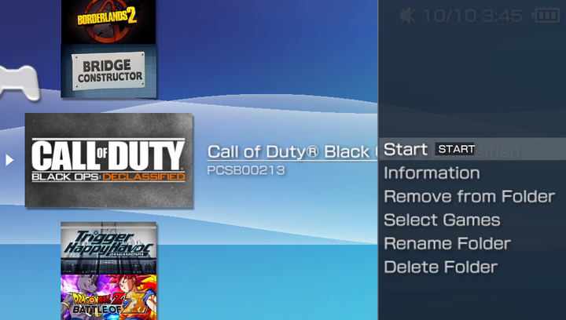 <br> **Options** (triangle) - Start, Information, Refresh | 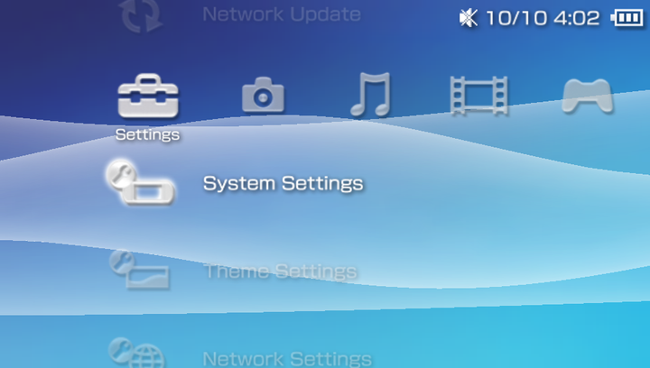 <br> **Settings** - the PSP's settings groups |
| 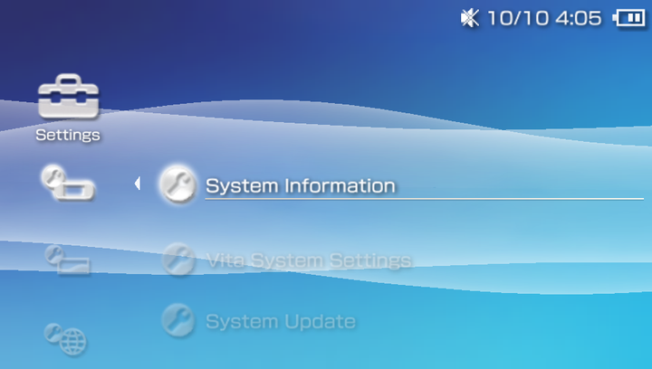 <br> **Two-level Settings layout** | 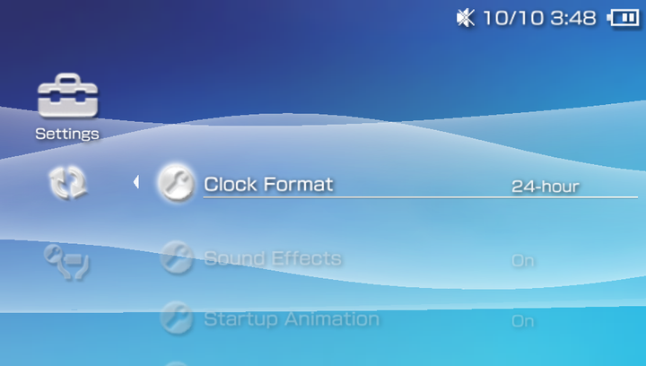 <br> **VitaXMB Settings** - values on the right |
| 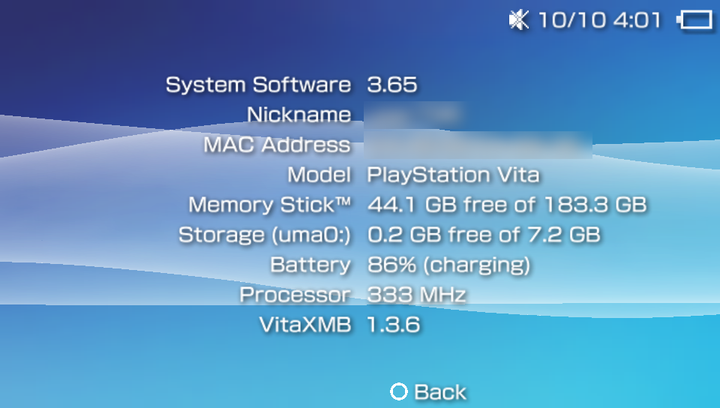 <br> **System Information** (nickname and MAC blurred) | 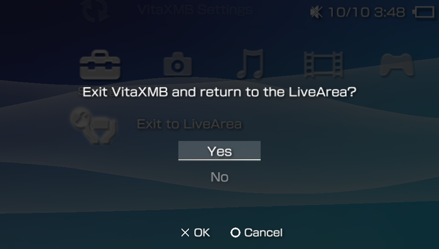 <br> **Confirmation dialog** |
| 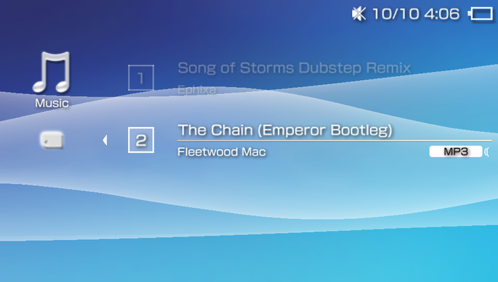 <br> **Music** - track list with ID3 tags | 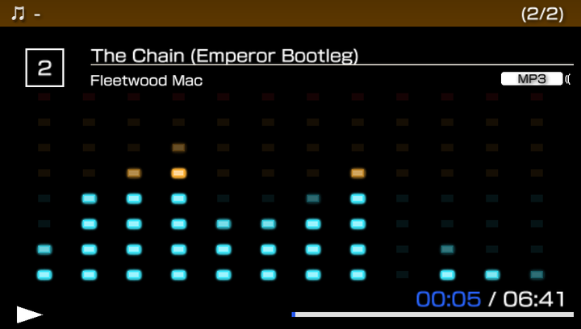 <br> **Music player** - real-time LED spectrum |
| 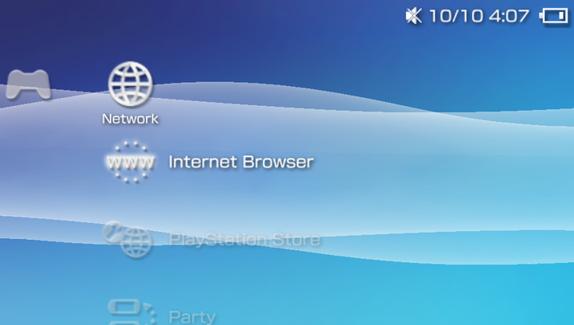 <br> **Network** - the Vita's online apps | |

## Controls

| Button | Action |
|---|---|
| D-pad / left stick **Left, Right** | Change category. Inside a Settings page: **Left** goes back, **Right** changes the selected value |
| D-pad / left stick **Up, Down** | Move through the list (hold to repeat) |
| **L / R** | Jump five rows |
| **Cross** | Open / start / change a value |
| **Circle** | Back, close a page or dialog |
| **Triangle** | Options (on a game, a folder or saved data) |

Music player: **Cross** play/pause, **L / R** previous/next track, **Left / Right** seek 10 s, **Circle** leave the player (the music keeps playing).

## Installing

VitaXMB is an *unsafe* homebrew (it reads other apps' folders and launches other titles), so it needs a hacked Vita with **HENkaku / Enso** and *Enable Unsafe Homebrew* switched on.

1. Build `VitaXMB.vpk` (see below) or take it from a release.
2. Copy it to the Vita and install it with VitaShell (Cross on the file, then confirm).
3. Start **VitaXMB** from the LiveArea. Settings are saved in `ux0:data/VitaXMB/config.bin`; failures are logged to `ux0:data/VitaXMB/log.txt`.

## Starting VitaXMB when the Vita turns on

Two small community plugins make VitaXMB the first thing you see: **AutoBoot** starts an app as soon as the Vita has booted, and **NoLockScreen** removes the swipe-to-unlock screen. Neither is part of VitaXMB and both are optional.

**1. Install the plugins.** The easiest way is [**AutoPlugin 2**](https://github.com/ONElua/AutoPlugin2), a plugin manager: install AutoBoot and NoLockScreen through it and it registers them for you, so you do not have to edit `tai/config.txt`. Both are also on [VitaDB](https://www.rinnegatamante.eu/vitadb/#/).

**2. Tell AutoBoot to start VitaXMB.** In AutoPlugin 2 open **Extras > AutoBoot > Select App** and pick **VitaXMB** from the list. That is all.

Or do it by hand: AutoBoot reads the **title ID** of the app, not its name. Open `ux0:data/AutoBoot/boot.cfg` (create it if it does not exist) and make its only content:

```
VXMB00001
```

No spaces, no extra lines. Typing `VitaXMB` does not work: the Vita identifies apps by their title ID, the folder name under `ux0:app/`. VitaXMB is `VXMB00001`.

**3. NoLockScreen.** Nothing to configure when it was installed through AutoPlugin 2. Use version 2.0 or newer: it also skips the lock screen at boot (older versions only skip it when you wake the Vita). If you install it by hand, copy `nolockscreen.suprx` to `ux0:tai/` and add `ux0:tai/nolockscreen.suprx` under `*main` in `tai/config.txt`. See [NoLockScreen on GameBrew](https://www.gamebrew.org/wiki/NoLockScreen_Vita). Note that it also bypasses any passcode you have set, so anyone who picks up the Vita can use it.

**If it does not start:**

- VitaXMB must be installed (its bubble is on the LiveArea) and **Enable Unsafe Homebrew** must be on in the HENkaku settings.
- Check that `boot.cfg` holds exactly `VXMB00001`.
- Hold **L1** while the Vita boots to skip plugins, and look at the plugin list in AutoPlugin 2.
- A plugin that starts an app at boot can fire before the system is ready; some builds have a delay setting.

## Building from source

You need the [VitaSDK](https://vitasdk.org/) plus these libraries from its package manager:

```sh
vdpm vita2d libpng libjpeg-turbo freetype harfbuzz zlib bzip2 taihen mbedtls
```

Then, with `VITASDK` set:

```sh
cmake -S . -B build          # add  -G Ninja  if you use Ninja
cmake --build build
```

The result is `build/VitaXMB.vpk` (and `build/VitaXMB.self`, the `eboot.bin`).

Notes

- On Windows the prebuilt VitaSDK toolchain works with CMake and Ninja (`pip install ninja`); `vdpm` needs a POSIX shell, or you can unpack the package archives from <https://github.com/vitasdk/packages> into the SDK yourself.
- The build links a tiny *weak* import stub (`third_party/vitashell_stub`) for the optional artwork-decryption feature; it is harmless if VitaShell's modules are not present.
- The executable is built with the same auth ID VitaShell uses (`-a 0x2808000000000000`, see `CMakeLists.txt`) so it may start other titles.

## How it works

```
                     +-------------------+
   pad / remote ---> |  main loop (60fps)|----> vita2d (GXM)  <--- text engine (FreeType + HarfBuzz atlas)
                     +---------+---------+
        icon_thread  <---------+---------> bg_thread   (full-screen backgrounds)
        music_thread <---------+---------> audio_thread (mixer: UI sounds + music ring)
                               +---------> dec_thread   (optional artwork decryption)
```

- **Layouts.** Every list is a `Menu` of `Item`s. A menu is drawn by one of three layouts: the category *column*, the wide-tile *game folder*, or the Settings-style *sub list* (`menu_layout()`); transitions between them are eased values (`folder_t`, `sub_t`, `page_t`, `dlg_t`, `opt_t`).
- **Selection emphasis** (brightness, glow, rule) follows an eased per-item `glow` value, not the slide position, so a row lights up the moment it is selected.
- **Art loading.** Rows near the cursor ask the loader thread for their art; it resolves LiveArea files, decodes and downscales PNGs off-thread, and the render thread uploads at most two per frame.
- **Text.** HarfBuzz shapes each string (kerning); glyphs are rasterised by FreeType at four sub-pixel phases into a padded atlas together with a blurred shadow bitmap, then drawn as textured quads.
- **Music.** minimp3 decodes on its own thread into a 48 kHz ring buffer; the audio mixer drains it alongside the UI sounds and publishes the last 1024 samples, from which a Goertzel filter bank computes the 12 spectrum bands.
- **Safety.** Textures are freed on a deferred list after the GPU has gone idle (freeing a texture the GPU still reads crashed the Vita).

### Fonts

The font clone shipped in `assets/font.otf` has been **baseline-normalised**. The original design places flat letters about 17 units below the baseline, round letters 35 units below it, and gives x-height and cap-height tops that differ per glyph. At 20-28 px those fractions get rounded into whole pixel rows, so for instance an *m* looked a row higher than an *a* or *e*. The shipped file remaps every Latin glyph's y-coordinates through one piecewise-linear function that collapses each alignment zone to a single value (baseline 0, x-height 596, cap height 782). Verified on the device by rendering all 94 ASCII glyphs at 20, 22, 24 and 28 px and measuring every glyph's top and bottom pixel row: all aligned.

Any OpenType/TrueType font can be dropped in as `assets/font.otf`.

## Game artwork

Rows show the landscape *gate* image of the app's LiveArea and, on rest, its background. They are found in this order: the app's own `sce_sys/livearea` (homebrew), LiveArea's copy in `ur0:appmeta/<id>/livearea`, and the plain `pic0.png` copy in `ur0:appmeta/<id>`.

Retail games' own files are encrypted, and the Vita only keeps `appmeta` copies for roughly 500 bubbles. For games without one, run **[CopyIcons](https://github.com/cy33hc/copyicons)** once: it copies each game's `pic0.png`/`icon0.png` into `ur0:appmeta`, and VitaXMB picks them up. Games with no artwork at all show their square icon on a landscape plate.

An experimental *Decrypt Artwork (beta)* setting (off by default, asks for confirmation) can mount a game's encrypted files through VitaShell's own kernel modules, as CopyIcons does, and cache the plain copies. It loads kernel modules and has frozen a test device, so treat it as an experiment.

## Music and video

- Music plays **MP3** files. The system blocks apps from reading `ux0:music`, so VitaXMB scans **`ux0:pspemu/MUSIC`** (Adrenaline's folder). Put your songs there. FLAC and WAV are not supported.
- Videos are listed from `ux0:pspemu/VIDEO`; selecting one opens the Vita's Videos app (a decoder is out of scope).

## Folders

Organise your games and homebrew in **Game > Memory Stick™**. Press **Triangle** for Options:

- **New Folder** asks for a name with the Vita's own keyboard, then opens the picker.
- The **picker** lists every installed app with a tick box. **Cross** ticks or unticks, **L / R** jump five rows, **Triangle** selects all or none, **Circle** saves and closes. A game that is already in another folder shows where; ticking it moves it.
- On a folder (or inside one): **Select Games** reopens the picker, **Rename Folder**, **Delete Folder** (asks first; the games stay installed and return to the main list). Inside a folder, **Remove from Folder** takes the highlighted game out.

Folders are listed first, then the games that are in no folder. A game is in at most one folder. Everything is stored in `ux0:data/VitaXMB/folders.txt` (plain text, one `F` line per folder followed by `A` lines with title IDs), so it survives uninstalling and reinstalling a game.

## Updates

VitaXMB can update itself from its GitHub releases (`dekiller82/VitaXMB`).

- **Settings > Network Update** (the first item) checks for a newer release, shows its release notes (scroll with Up / Down or L / R) and installs it. With **Check for Updates at Start** on (*VitaXMB Settings*, on by default), a notice appears a few seconds after startup when a newer release exists.
- Installing closes VitaXMB, hands over to a small bundled app (*VitaXMB Updater*) that shows a progress screen, installs the package and starts VitaXMB again. The updater app is installed automatically the first time and refreshed when it changes.
- The download uses its own HTTPS client, because the Vita's built-in SSL library cannot complete a handshake with GitHub.
- Installing needs VitaShell's modules in `ux0:VitaShell` (the same ones VitaShell uses to install packages). If the system installer refuses the package, the downloaded `.vpk` is kept in `ux0:data/VitaXMB/` so you can install it with VitaShell.
- Tags are compared as `major.minor.patch` (`v1.2.0`, `1.3`); keep minor and patch under 100.

## Custom themes (beta)

**This is a beta. Please test it and tell me what you see.** VitaXMB can load the PSP's custom themes (`.ctf` and `.ptf`, the 6.60 / 6.61 CXMB kind). Put theme files in `ux0:data/VitaXMB/themes` (or `ux0:pspemu/PSP/THEME`) and choose one under *Settings > Theme Settings > Custom Theme (beta)*. Choosing *Off* returns to the stock look.

What is read from a theme today:

- **Look:** wallpaper or the month's sky (the set the real XMB loads on a PSP-3000 and later), the colour pictures, text and icon colours, icon sizes and the theme's font.
- **Background and boot:** the wave (a theme's own model, or none), the boot intro and the XMB sounds.
- **Category bar and lists:** icons, spacing, gap and move speed of the bar, strip, panel and text-list layouts, the row spacing of every list and how fast lists scroll, and how far the bar slides aside when a list opens. These come from the theme's code patches for `paf.prx`, `vshmain.prx` and `common_gui.prx`, which VitaXMB reads and applies.
- **Text:** the size of the sub text under a row and of the Options text, and the text shadow, as the theme sets them.
- **Status bar:** the clock (position, size, opacity and colour), the battery and its charging animation, the mute icon and the busy spinner, in the theme's own pictures or the PSP's.
- **Pictures:** the Options panel and game list positions (including a folder's Options), the separator line, arrows, check boxes, the glow behind the selected row, shadows, the button glyphs and their colours, and the loading and broken pictures of game and save rows.
- **3D themes** that turn the whole XMB in space.
- **Random:** choose *Random* at the end of the Custom Theme list to get a different theme at every start.

Not supported yet: some theme layout constants whose meaning needs a real PSP to check against, the special-date skies, the game boot video, fonts other than the main one, and themes made for firmware other than 6.60 / 6.61. The PSP's keyboard, HOME menu and volume overlay are drawn by the Vita itself and are not themed.

A PSP theme is partly code (patches to the PSP's own modules), which the Vita cannot run, so VitaXMB reads what the theme *says* and imitates the rest. Some themes will look different from the real PSP, and some parts are not supported yet.

**Please help by reporting what is wrong.** Open an [issue](https://github.com/dekiller82/VitaXMB/issues) with:

- the theme's name and where you got it,
- a **screenshot from VitaXMB**,
- if you can, a **reference of the same screen on the real PSP XMB** (the same menu, the same selected item). You don't need a PSP: run the theme in **Adrenaline** on your Vita (it runs the PSP's own XMB) and take a screenshot there, or photograph a real PSP,
- what looks wrong (position, colours, sounds, animation, a crash).

The PSP reference is the most useful part: it shows what the theme is supposed to look like, which the theme file alone does not. Themes are not included in this repository; they belong to their authors.

## Extra storage (experimental)

**Beta, off by default. Please test it and report what you see.** If a storage manager (StorageMgr, YAMT and similar) mounts a second card as `uma0:`, `imc0:`, `xmc0:` or `grw0:`, the *Extra Storage (beta)* setting makes VitaXMB also look there:

- music in `<card>/music` and `<card>/pspemu/MUSIC`
- videos in `<card>/video`, `<card>/pspemu/VIDEO` and `<card>/Movies`
- a *Storage (<card>)* row with free and total space in System Information

The setting shows what it found (`Off`, `On (none)`, `On (uma0:)`, `On (N cards)`). Duplicates are skipped, because memory cards ignore letter case.

Tested on one console: an SD2Vita as `ux0:` plus a real memory card mounted as `uma0:`; its music is listed and playable. Not tested: videos from a second card, other mount names, and games or saved data on the second card (the game list still reads `ux0:app` only).

## Settings reference

**Settings > VitaXMB Settings**

| Setting | Values | Notes |
|---|---|---|
| Clock Format | 24-hour / 12-hour | status bar |
| Sound Effects | On / Off | UI sounds and music mixing are independent |
| Startup Animation | On / Off | fade in + slide in |
| Confirmation Dialogs | On / Off | asks before leaving the XMB |
| Game Launch Method | A-D | the system call and flag used to start a title |
| Photo / Music / Video / Network Category | Shown / Hidden | hides that category from the bar; Settings and Game always stay |
| Check for Updates at Start | On / Off | looks for a new release a few seconds after startup, see [Updates](#updates) |
| Extra Storage (beta) | On / Off | experimental, see above |
| Decrypt Artwork (beta) | On / Off | experimental, see above |

**Settings > Theme Settings > Custom Theme (beta)**: Off or one of the PSP themes found, see [Custom themes (beta)](#custom-themes-beta).

**Settings > Theme Settings > Color**: automatic (follows the month, like the PSP) or any of the twelve months. October is measured from a real PSP capture; the other months are approximations.

**Settings > System Settings**: *System Information*, plus shortcuts to the Vita's own Settings pages.

## Development

Release builds contain no debugging code. Configure with `-DVITAXMB_DEBUG=ON` to add:

- `ux0:data/VitaXMB/trace.txt`: breadcrumbs, slow-frame timings (`input / icons / draw / swap`) and launch results.
- A file-based **remote control**: write space-separated commands to `ux0:data/VitaXMB/remote.txt` and the app executes one per frame, then deletes the file. Commands: `left right up down cross circle triangle l r`, `w<frames>` (wait), `shot:<name>` (save `ux0:data/VitaXMB/<name>.png`), `page:text` / `page:off` (glyph test page), `hint:<0-3>` (text hinting mode), `uri:<hexflags>:<uri>` (try a launch request).
- This is how the screenshots and the demo GIF in this README were captured, over an FTP connection to the console.

## Repository layout

```
CMakeLists.txt            build definition (VPK, SELF, assets)
src/main.c                the launcher: main loop and input
src/core/                 data, config, items and menus, game scanning, artwork, settings, the updater
src/media/                sound mixer, media scan, music player
src/render/               textures, drawing, text engine, backgrounds, waves
src/theme/                PSP theme loader, RCO runtime, boot intro, theme sounds, the PSP engine's list styles and easing (paf.h)
src/ui/                   layouts, lists, pages, dialogs, pickers
updater/main.c            the small installer app (VitaXMB Updater)
assets/psp/               the PSP boot intro resource
sce_sys/                  bubble icon and LiveArea files of the VitaXMB app itself
assets/font.otf           baseline-normalised UI font
assets/icons/             PSP-style XMB icons (PNG)
assets/sounds/            XMB sound effects (48 kHz stereo PCM)
third_party/minimp3/      MP3 decoder (CC0)
third_party/vitashell_stub/  import stub + headers for VitaShell's user module
docs/                     README images
```

Everything in the tree is needed to build; nothing else is committed.

## Known issues

- **Starting a game shows the Vita's LiveArea bubble transition** before the game appears. The system draws it whenever one app starts another, so no launcher (VitaShell and vita-launcher included) can skip it; only a shell-level plugin could.
- **System apps cannot be started by title ID** from an app (the Vita shows error `C2-12570-5`). VitaXMB therefore opens them through their own URI schemes (`wbapp0:` Browser, `settings_dlg:` Settings, `psns:` PlayStation Store, `pspy:` Party, `psnmsg:` Messages, `near:` Near, `photo:`, `music:`, `video:`). The Browser and the Settings pages are confirmed to work; the others come from a working third-party launcher but have not been tried on every setup.
- If launch requests are being refused (the call returns `0x80802026` in a debug build), the console's app manager is in a bad state: reboot the Vita.
- `ux0:music`, `ux0:video` and `ux0:picture` cannot be read by apps; use the Adrenaline folders or the Vita's own apps.
- The PlayStation Network and "Extras" categories of the real PSP are not implemented.
- The *Decrypt Artwork (beta)* experiment can freeze the console; it is off by default.
- *Extra Storage (beta)* is new and lightly tested, see above.
- **Custom themes are a beta**: some themes differ from the real PSP and some theme features are not implemented, see [Custom themes (beta)](#custom-themes-beta).
- **Updating needs VitaShell's modules** in `ux0:VitaShell`; without them the update is downloaded and left for you to install with VitaShell.

## Credits and licenses

VitaXMB is released under the **GNU GPL v3** (see `LICENSE`).

- [VitaSDK](https://vitasdk.org/), [libvita2d](https://github.com/xerpi/libvita2d), [FreeType](https://freetype.org/), [HarfBuzz](https://harfbuzz.github.io/), libpng, libjpeg-turbo, zlib, bzip2.
- [minimp3](https://github.com/lieff/minimp3) by lieff (CC0).
- [mbed TLS](https://github.com/Mbed-TLS/mbedtls) for the update download (Apache-2.0 / GPL-2.0-or-later).
- [VitaShell](https://github.com/TheOfficialFloW/VitaShell) by TheFloW (GPL-3.0) and [CopyIcons](https://github.com/cy33hc/copyicons) by cy33hc (GPL-3.0): the user-module header, the import stub and the PFS-mount approach used for artwork decryption, and the way packages are installed (system installer plus a helper app, as in VitaShell's own updater).
- [vita-uriCaller](https://github.com/Freakler/vita-uriCaller) for the list of system URIs.
- [CXMB](https://github.com/PSP-Archive/CXMB) and the PSP homebrew community's documentation of the `.ctf` / `.ptf` theme format, the RCO resource format (RCOMage by ZiNgA BuRgA and Youness Alaoui, for its attribute tables) and the PGF font format (as read by [PPSSPP](https://github.com/hrydgard/ppsspp)).

**Third-party assets.** The XMB icons, sound effects and typeface in `assets/` imitate the look of Sony's PSP system software and the FOT-NewRodin typeface and are included as supplied by the project author for personal, non-commercial use. The wave model, the month sky pictures and the boot intro resource (`assets/psp/`) are taken from the PSP firmware's own resources. They remain the property of their respective owners and are not covered by the GPL. If you are a rights holder and want them removed, please open an issue.

VitaXMB is an independent fan project. It is not affiliated with or endorsed by Sony Interactive Entertainment. "PlayStation", "PSP", "PS Vita" and "XMB" are trademarks of their respective owners.
